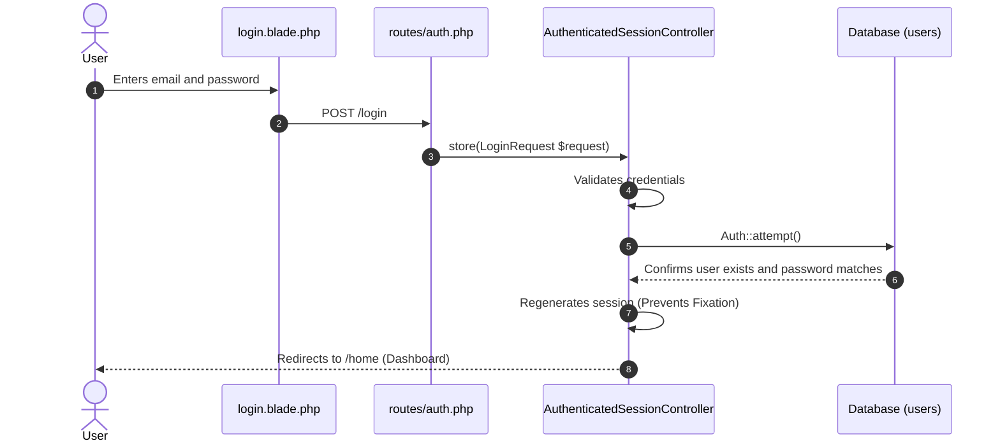
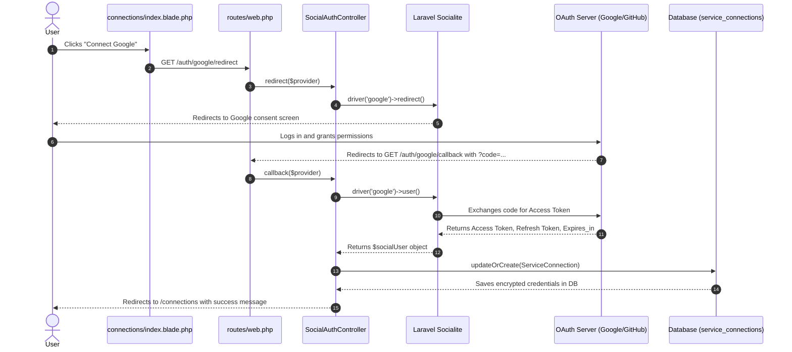
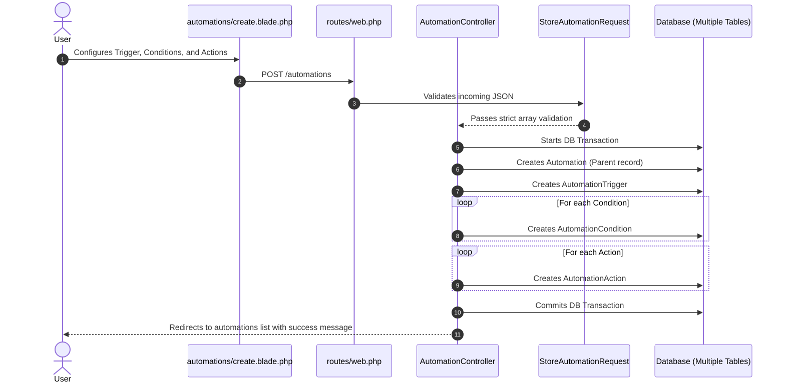
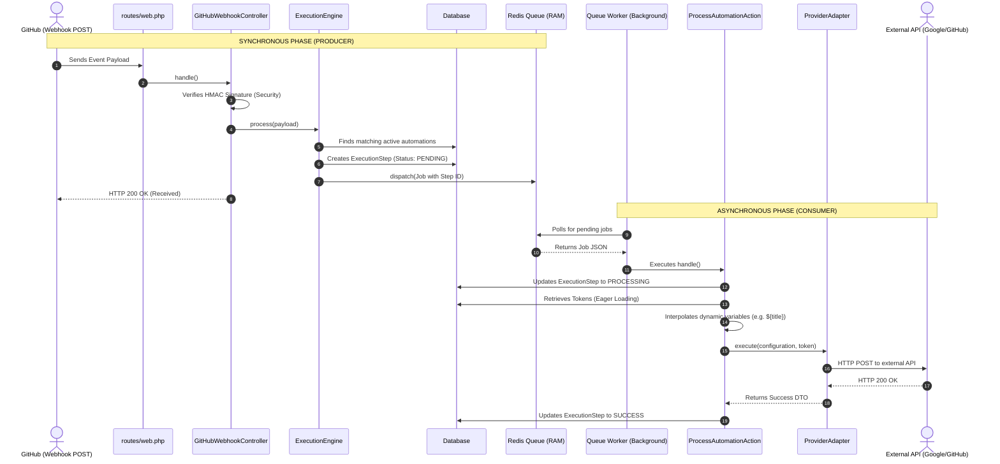
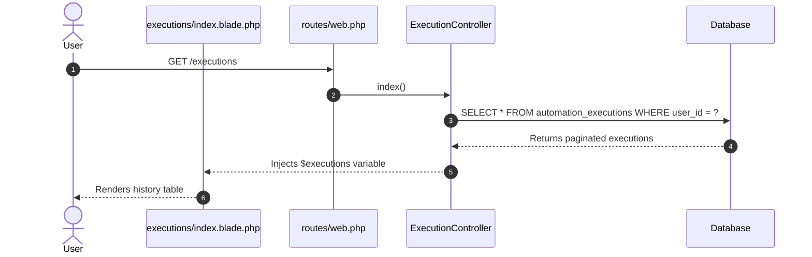
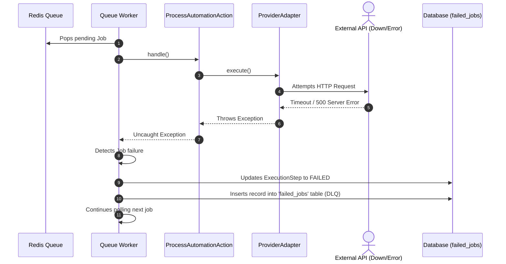
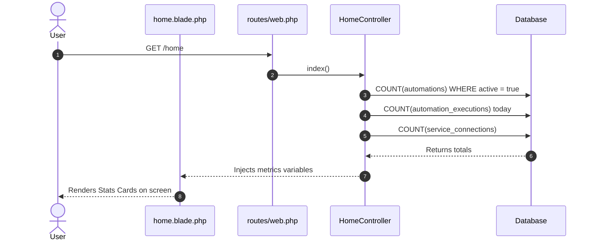

# FlowHub Sequence Diagrams 🗺️

This document contains the technical sequence diagrams for all core application flows.
> **Note on VS Code:** By default, VS Code displays Markdown files as raw text. To view these Mermaid diagrams correctly, you need to install the **"Markdown Preview Mermaid Support"** extension and open the Markdown Preview (Ctrl+Shift+V or by clicking the split-preview icon in the top right corner).

---

## 1. Authentication Flow (Login & Register)

---

## 2. OAuth Connection Flow (Google/GitHub)

---

## 3. Automation Management Flow (CRUD)

---

## 4. Core Execution Flow (Webhook -> Worker -> API)

---

## 5. Execution History Flow (Logs)

---

## 6. Error Handling Flow (API Failures / DLQ)

---

## 7. Dashboard Flow (Real-time Metrics)

