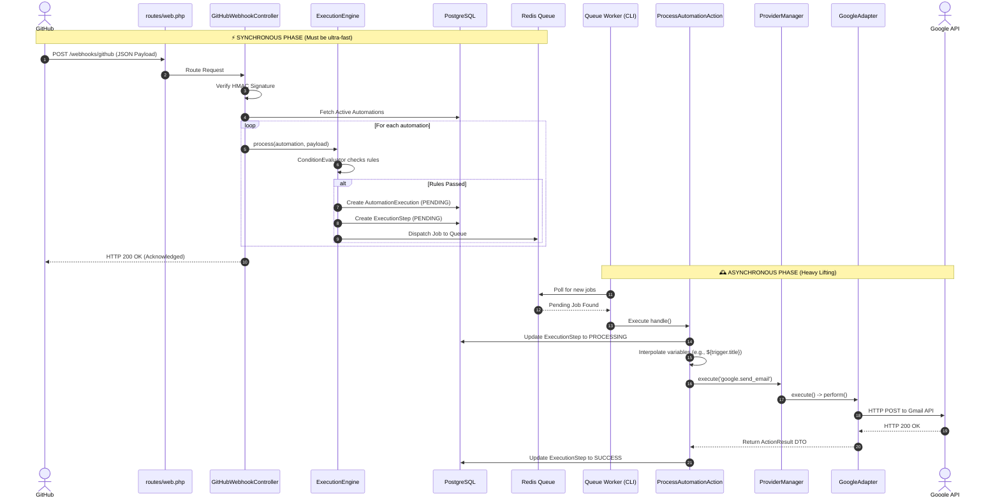

# FlowHub 🚀

FlowHub is a distributed personal automation platform that allows users to connect their online applications and services to "talk" to each other without manual intervention. 

Think of it as a self-hosted alternative to Zapier or Make. You define automations of the type *"when X happens, then do Y (and then Z)"*. The system handles the execution asynchronously using a robust background worker and a message broker.

---

## 🏗️ Architecture & Automation Lifecycle

The platform is strictly separated into a **Synchronous Web Application** (Producer) and an **Asynchronous Worker** (Consumer). Communication between them happens exclusively via **Redis**.



---

## 🛠️ Prerequisites

Before you begin, ensure you have the following installed on your machine:
- **[PHP >= 8.2](https://windows.php.net/download/)**
- **[Composer](https://getcomposer.org/download/)**
- **[PostgreSQL](https://www.postgresql.org/download/)** (or MySQL/MariaDB)
- **[Redis Server](https://github.com/tporadowski/redis/releases/tag/v5.0.14.1)** (For Windows, download the portable `.zip` from this link and extract it in the root folder)
- **[Git](https://git-scm.com/downloads)**

---

## ⚙️ Installation & Setup

### 1. Clone the Repository
```bash
git clone git@github.com:your-username/flowhub.git
cd FlowHub
```

### 2. Install Dependencies
```bash
composer install
npm install
npm run build
```

### 3. Environment Configuration
Copy the environment template and generate your app key:
```bash
cp .env.example .env
php artisan key:generate
```

Update your `.env` file with your specific credentials:
```env
# Database
DB_CONNECTION=pgsql
DB_HOST=127.0.0.1
DB_PORT=5432
DB_DATABASE=flowhub
DB_USERNAME=your_db_user
DB_PASSWORD=your_db_password

# Queue (Must be redis, NOT database)
QUEUE_CONNECTION=redis

# OAuth Credentials (Client ID & Secrets)
GOOGLE_CLIENT_ID=your_google_client_id
GOOGLE_CLIENT_SECRET=your_google_client_secret
GOOGLE_REDIRECT_URI="${APP_URL}/auth/google/callback"

GITHUB_CLIENT_ID=your_github_client_id
GITHUB_CLIENT_SECRET=your_github_client_secret
GITHUB_REDIRECT_URI="${APP_URL}/auth/github/callback"

# GitHub Webhook Security
GITHUB_WEBHOOK_SECRET=your_secure_random_string
```

### 4. Run Migrations
```bash
php artisan migrate
```

---

## 🚀 Running the Application

To achieve the asynchronous decoupling required by the architecture, you must run several processes independently. **Open separate terminal windows for each of the following commands:**

### Terminal 1: The Web Application
Starts the Laravel development server.
```bash
php artisan serve
```

### Terminal 2: The Redis Server (If not running as a service)
If you downloaded the portable Redis version on Windows:
```bash
# Example for portable redis
.\redis\redis-server.exe
```

### Terminal 3: The Background Worker
Consumes jobs from the Redis queue and executes the automation actions.
```bash
php artisan queue:work redis --queue=automations --tries=4 --timeout=120
```

### Terminal 4: The Scheduler
Runs due scheduled automations every minute (only enqueues jobs; actions run in the worker).
```bash
php artisan schedule:work
```

### Terminal 4: The Webhook Tunnel (Pinggy)
Exposes your local server to the internet so GitHub can send HTTP POST requests.
```bash
ssh -p 443 -R0:127.0.0.1:8000 a.pinggy.io
```
*(Copy the `https://...pinggy.link` URL provided in the output. You will need it for the GitHub setup).*

---

## 🔗 GitHub Webhook Configuration

To trigger automations from GitHub events (like a new issue being opened), you must configure a webhook in your repository:

1. Go to your GitHub Repository -> **Settings** -> **Webhooks**.
2. Click **Add webhook**.
3. **Payload URL:** `https://<your-pinggy-url>/webhooks/github` (Make sure to append `/webhooks/github`).
4. **Content type:** `application/json` (Crucial!).
5. **Secret:** Enter the exact string you placed in `GITHUB_WEBHOOK_SECRET` in your `.env` file.
6. **Which events would you like to trigger this webhook?** Select **Send me everything** (or select specific events like *Issues*, *Push*, etc.).
7. Ensure **Active** is checked and click **Add webhook**.

---

## 🛡️ Security Notes
- **Never commit your `.env` file.** All secrets (`Client Secrets`, `Webhook Secrets`) must be kept out of version control.
- **Tokens are stored securely.** OAuth Access Tokens and Refresh Tokens are managed by the database and should be encrypted at rest in a production environment.
- The webhook endpoint implements **HMAC SHA-256 signature verification** to ensure that only legitimate payloads from GitHub are processed.
