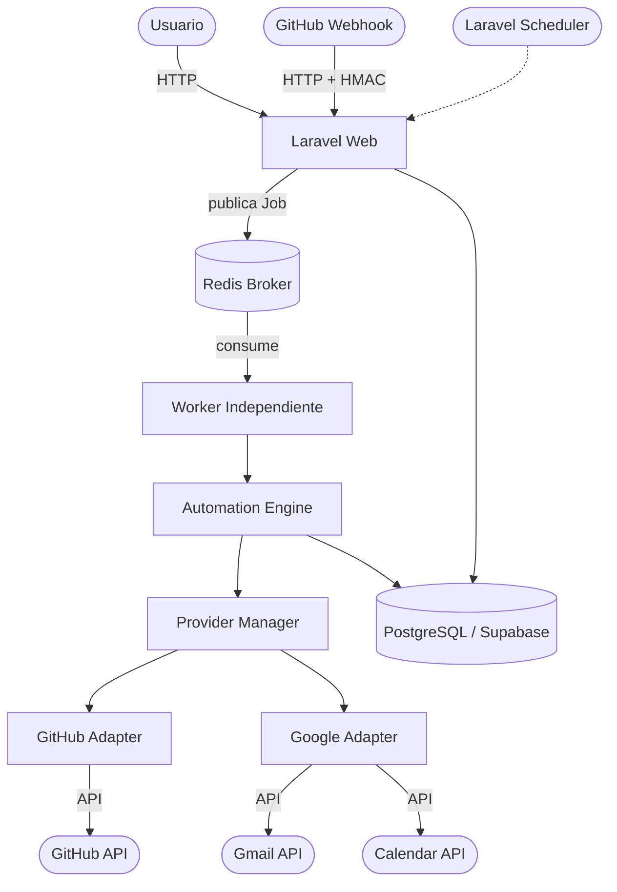

# FlowHub - Plataforma de Automatización Personal

FlowHub es una plataforma distribuida de automatización que permite conectar aplicaciones y servicios en línea (como GitHub y Google) para que interactúen entre sí mediante reglas de "si ocurre X, entonces haz Y" (automatizaciones). El proyecto fue desarrollado siguiendo una arquitectura asíncrona robusta.

## Diagrama de Arquitectura



El diagrama anterior ilustra el flujo: ya sea por un evento (webhook) o por tiempo (scheduler), la aplicación web publica un trabajo (Job) en el broker Redis. Un worker independiente lo consume, procesa la cadena de acciones de forma asíncrona mediante adaptadores, y registra todo en la base de datos PostgreSQL.

## Requisitos Previos
* **PHP** 8.2+
* **Composer**
* **Node.js** & NPM
* **PostgreSQL** (se puede usar Supabase)
* **Redis** (como broker externo obligatorio)
* Un túnel HTTP como **Cloudflare Tunnel** o **ngrok** (para recibir webhooks en local)

## 1. Instalación y Configuración

Clonar el repositorio y configurar dependencias:
```bash
git clone <url-del-repositorio>
cd FlowHub
composer install
npm install
```

Configurar el entorno (`.env`):
Copia el archivo de ejemplo:
```bash
cp .env.example .env
php artisan key:generate
```

### Configurar Supabase y SSL (PostgreSQL)
Abre el archivo `.env` y ajusta las credenciales de la base de datos para Supabase. Asegúrate de incluir el soporte SSL para conexiones externas si Supabase lo requiere:
```env
DB_CONNECTION=pgsql
DB_HOST=aws-0-....pooler.supabase.com
DB_PORT=5432
DB_DATABASE=postgres
DB_USERNAME=postgres.xxxx
DB_PASSWORD=tu_password
# Agregar si es necesario por Supabase
# PDO_MYSQL_ATTR_SSL_CA=...
```

### Configurar Redis y colas
Es indispensable levantar un servidor Redis (puede ser vía Docker):
```bash
docker run --name redis -p 6379:6379 -d redis
```
En tu `.env`, asegúrate de tener:
```env
REDIS_HOST=127.0.0.1
REDIS_PASSWORD=null
REDIS_PORT=6379

QUEUE_CONNECTION=redis
```
*(No se admite usar `sync` o `database` para la cola).*

## 2. Configuración de Credenciales de Cliente (OAuth y Webhooks)

### GitHub OAuth & Webhooks
1. Registra una OAuth App en los [Developer Settings de GitHub](https://github.com/settings/developers).
2. Obtén el **Client ID** y **Client Secret**.
3. Configura el Callback URL como `https://<tu-tunel>/auth/github/callback`.
4. Para el Webhook de eventos, configura una URL en un repositorio o a nivel cuenta hacia `https://<tu-tunel>/webhooks/github`, tipo de contenido `application/json`, envía solo el evento `issues`, y genera un secreto de alta entropía.

En tu `.env`:
```env
GITHUB_CLIENT_ID=tu_client_id
GITHUB_CLIENT_SECRET=tu_client_secret
GITHUB_REDIRECT_URI=https://<tu-tunel>/auth/github/callback
GITHUB_WEBHOOK_SECRET=tu_secreto_webhook
```

### Google OAuth (Gmail & Calendar)
1. En Google Cloud Console, crea un proyecto.
2. Habilita la **Gmail API** y la **Google Calendar API**.
3. Configura la **OAuth Consent Screen**. Si la aplicación está en modo *Testing*, deberás añadir tu cuenta de Google como **Tester**. (Nota: En modo Testing los refresh tokens suelen expirar a los 7 días).
4. Crea credenciales tipo **Web Application**. Agrega `https://<tu-tunel>/auth/google/callback` como URI de redirección.
5. Obtén el **Client ID** y **Client Secret**.

En tu `.env`:
```env
GOOGLE_CLIENT_ID=tu_client_id
GOOGLE_CLIENT_SECRET=tu_client_secret
GOOGLE_REDIRECT_URI=https://<tu-tunel>/auth/google/callback
```

## 3. Base de Datos: Migraciones, Seed y Pruebas

Ejecuta las migraciones y puebla la base de datos inicial:
```bash
php artisan migrate:fresh --seed
```

Para correr la suite de pruebas (que automatiza la verificación de todos los componentes integrados):
```bash
php artisan test
```

## 4. Comandos de Ejecución y Levantamiento

El proyecto requiere ejecutar varios procesos de manera independiente. Abre **4 terminales** distintas:

1. **Aplicación Web (Productor):**
   ```bash
   php artisan serve
   ```
2. **Frontend Assets (Vite):**
   ```bash
   npm run dev
   ```
3. **Worker Independiente (Consumidor):**
   ```bash
   php artisan queue:work redis --queue=automations --tries=4
   ```
4. **Programador de Tareas (Scheduler):**
   ```bash
   php artisan schedule:work
   ```
*(Asegúrate de que tu túnel como ngrok o cloudflared esté corriendo y apuntando al puerto de `php artisan serve`, típicamente el 8000).*

## 5. Pasos exactos de una demo limpia

1. Levanta Redis, ngrok (o tunnel), y los 4 comandos descritos arriba.
2. Ingresa a la aplicación a través de la URL de tu túnel público y crea una cuenta nueva.
3. Ve a **Conexiones** y autoriza ambas cuentas: GitHub y Google (asegúrate de que los scopes solicitados se acepten).
4. Crea una **Automatización**:
   - **Trigger**: Webhook de GitHub.
   - **Condición**: El título del issue contiene `urgente`.
   - **Acción 1**: Enviar correo por Gmail (usando interpolación `{{trigger.issue.title}}`).
   - **Acción 2**: Crear evento en Calendar.
5. Apaga temporalmente el **Worker** (Ctrl+C en su terminal).
6. Ve a tu repositorio de GitHub conectado y crea un **nuevo issue** con la palabra "urgente" en el título.
7. Vuelve a FlowHub. Entra a **Historial**. Verás que la ejecución está en estado `pending` y la web respondió de inmediato a GitHub (el webhook funciona, pero las acciones aún no se ejecutan porque el worker está apagado).
8. Enciende de nuevo el **Worker**: `php artisan queue:work redis --queue=automations --tries=4`.
9. Observa la terminal del worker consumir el Job. Ve al historial, ahora dirá `successful`.
10. Revisa tu Gmail y Google Calendar; el correo fue enviado y el evento creado exitosamente.

---
**Nota de robustez:** El sistema integra *Idempotencia*, *Backoff* (reintentos con retraso por límites de tasa) y una *DLQ* para mensajes fallidos, garantizando una arquitectura resiliente y asíncrona.
